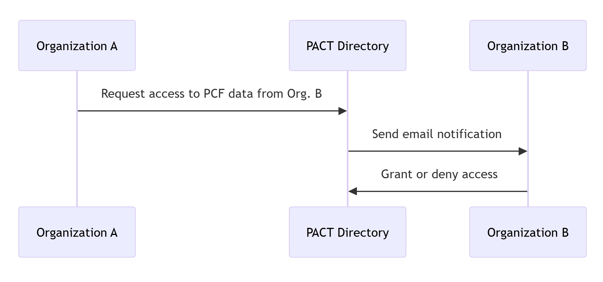
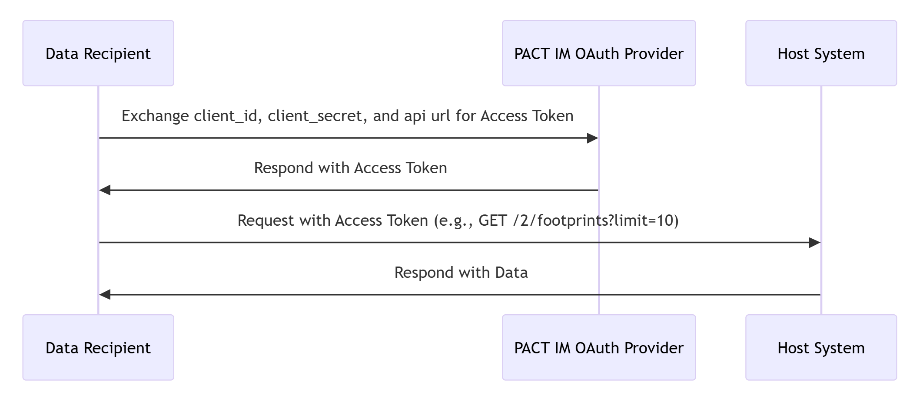
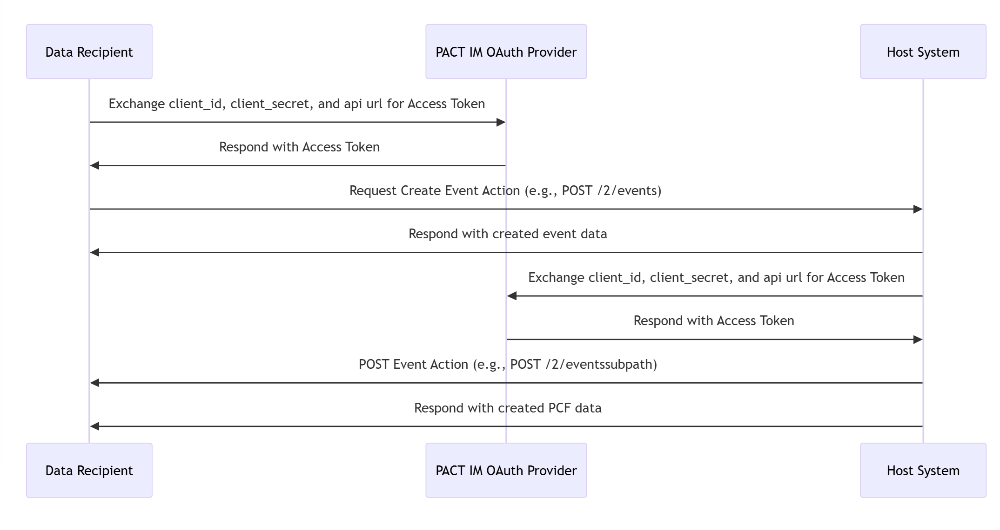

# Authentication as a Service Design

## Introduction

The purpose of this document is to outline the design of the authentication service for the PACT network. The authentication service will be responsible for managing client authentication and authorization for the systems exchanging data within the network.

## Technical Architecture

From a high level overview the PACT Authentication Service includes three key components:

- Organizations Store: A central database or storage solution that holds information about the various organizations in the network.
- PACT Directory Website: An interface for users within these organizations to discover and exchange PCF data. This interface also allows orgnisations to request and grant access to other organizations to their PCF data.
- PACT Authentication Service REST API: A RESTful API that allows client systems to authenticate using the OAuth 2.0 standard so they access the PACT conforming APIs in the network.

## Registering an organization in the PACT directory

When an organization wants to join the PACT network, it will need to register in the PACT directory website. The registration process will involve providing the organization's name, contact information, and other relevant details. Once the organization is registered, it will be able to request and grant access to other organizations sharing PCF data through their PACT compliant APIs.

## Data access request flow

When an organization wants to access PCF data from another organization, it will need to request access through the PACT directory. The second organization will receive an email notification directing them to PACT directory where they can grant or deny access to the requesting organization.

The authentication grant flow will be as follows:

## Credentials and Authentication

Each organization will be issued a `client_id` and `client_secret` pair that will be used to authenticate with the PACT Authentication Service. These credentials will be unique to each organization and will be used to identify the organization when making requests to the PACT Authentication Service to get an access token that will allow them to request PCF data from connected organizations.

When a PACT conforming API receives a request from a client system, it will validate the access token provided by the client system with the PACT Authentication Service to ensure that the client system is authorized to access the data using the `client_secret` issued by the Authentication Service to validate the access token's authenticity.

## API request (PCF data) flow

Once an organization has granted acess to another organization, the requesting organization's solution can authenticate with the PACT Authentication Service using an OAuth 2.0 flow where a `client_id`, `client_secret`, and the api url from the data source API are exchanged for an access token, then access the PCF from the organizations they have access to. The API requests flow will be as follows:

## Async bidirectional flow

When organizations exchange data in a bidirectional manner, each organization authenticates with the PACT Authentication service using their own credentials. The PACT Authentication service will then authenticate the clients and if the organizations are connected the exchange can take place.

## Authentication Service option analysis

Besides the OAuth 2.0 authentication flow, there are other options that can be used to secure the communication between the the organizations' systems in the PACT network.

### Mutual TLS

Mutual TLS (Transport Layer Security) authentication requires both client and server to present and verify certificates. In this setup, each server authenticates the other by validating SSL/TLS certificates, adding an extra layer of security beyond standard bearer tokens. It's a very secure since both servers authenticate each other with trusted certificates which adds resillience against most common attack vectors.

### Pros of mTLS

1. **Enhanced Security and Trust**

   - mTLS provides bidirectional (mutual) authentication, meaning both client and server verify each other’s identities. This significantly reduces the risk of impersonation attacks and ensures that only authorized servers can communicate with each other.

2. **Protection Against Man-in-the-Middle (MitM) Attacks**

   - Since both the client and server authenticate each other using certificates, mTLS makes it more challenging for attackers to intercept and alter communication between parties.

3. **No Dependency on Tokens or Passwords**

   - mTLS eliminates the need for passwords, API keys, or tokens, relying instead on X.509 certificates, which are harder to steal and misuse than credentials.

4. **Ideal for Zero Trust Architectures**

   - mTLS is often a key component of Zero Trust architectures, where each request must be authenticated and authorized, regardless of network location. This aligns with security models that assume no implicit trust.

5. **Message Integrity and Confidentiality**
   - Since TLS encryption is used, mTLS also provides data confidentiality and integrity. This means data is encrypted in transit, and unauthorized parties cannot alter or read it.

### Cons of mTLS

1. **Complexity in Certificate Management**

   - Implementing mTLS requires managing client and server certificates, including issuing, distributing, renewing, and revoking certificates. This adds operational overhead, especially in large-scale environments.

2. **Higher Setup and Maintenance Costs**

   - Unlike simpler authentication methods (like API keys or bearer tokens), setting up mTLS requires more initial configuration and ongoing maintenance, including certificate authority (CA) setup and policies for certificate lifecycles.

3. **Limited Compatibility**

   - Not all clients and servers support mTLS out of the box, which can make it challenging to adopt in heterogeneous environments where different platforms or applications must communicate.

4. **Scalability Challenges**

   - Managing certificates for each client in large-scale deployments can be complex and may not scale as well as other methods like OAuth. Maintaining mTLS in microservices architectures, for example, can become challenging without automated certificate management.

5. **Complexity in Error Handling and Debugging**
   - Troubleshooting issues with mTLS can be more complex because both sides need valid certificates. Errors in certificate validity, expiration, or misconfiguration can lead to connection failures that are harder to diagnose than other authentication errors.
