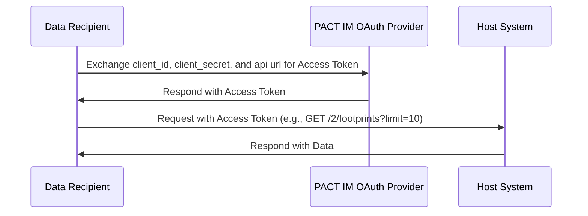
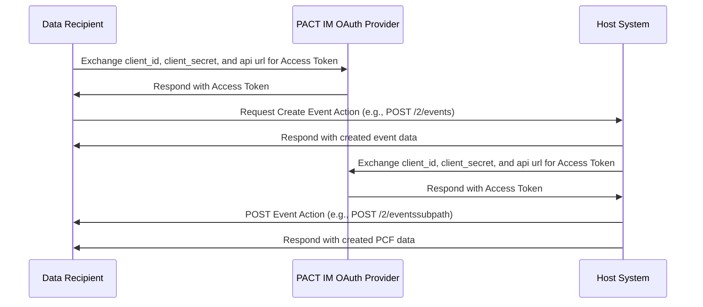

## Organization Access Request Flow

````mermaid
sequenceDiagram
    participant A as Organization A
    participant P as PACT Directory
    participant B as Organization B

    A->>P: Request access to PCF data from Org. B
    P->>B: Send email notification
    B->>P: Grant or deny access
    ```
````

## PACT IM OAuth Sequence Diagram



## Async Bidirectional Flow


