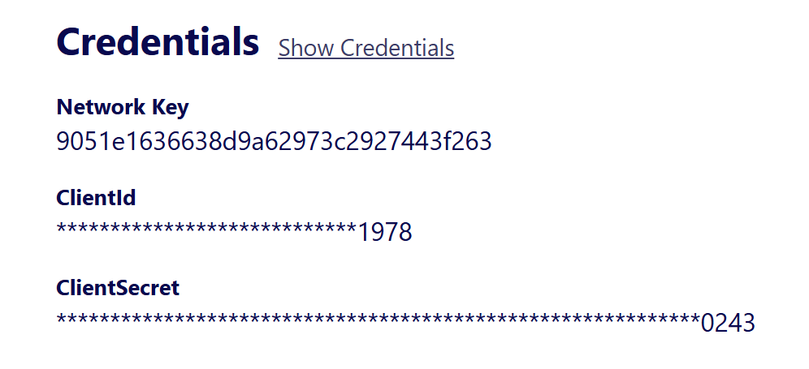
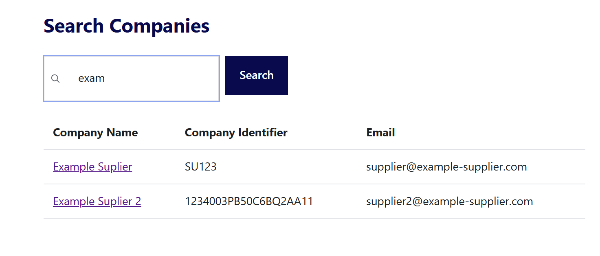
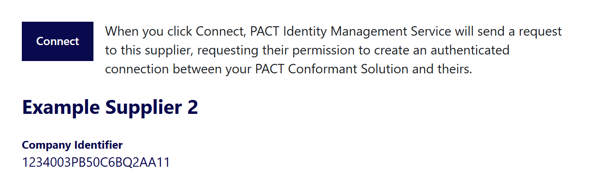
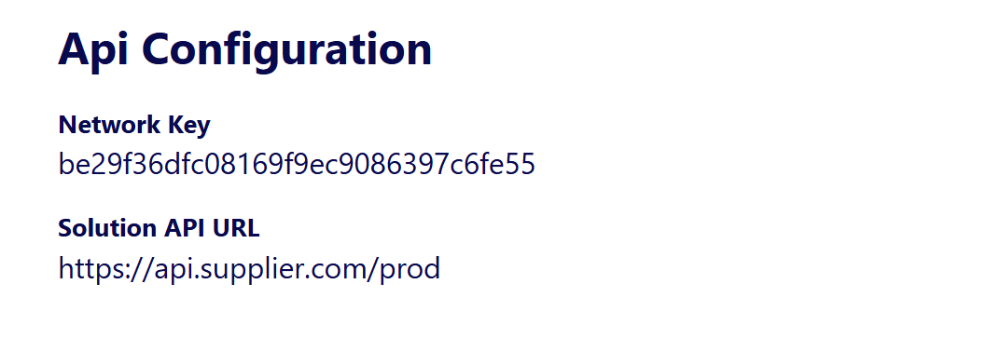

# Integration Guide for PACT Authentication Service

This integration guide provides instructions on how to integrate your solution with the PACT Authentication Service, ensuring secure and seamless authentication for your users. The steps this guide outline the process to set up and configure your PACT conformant api to work with the service, and leverage the authentication mechanism to connect with other PACT conformant apis in the network.

## 1. Register your organization in the PACT Directory

Go to https://pact-directory-portal.onrender.com/signup and register your organization using the registration code provided by PACT. Once you have registered, your account will be active immediately and you will be able to start testing.

## 2. Configure your solution with your PACT Authentication Service credentials

To be able to obtain an access token from the PACT Authentication Service, you need to configure your solution with the following credentials: `client_id` and `client_secret`. These credentials are unique to your organization and are used to authenticate your solution with the PACT Authentication Service. You get these credentials from the My Profile tab in the PACT Directory Portal.



## 3. Connect to an organization in the PACT Directory

Use the search tab in the PACT Directory Portal to find the organization you want to connect to. Once you have found the organization, go to the organization's profile, and click on the Connect button to send a connection request. The organization will receive the request and can accept or reject it.



Organization's profile page:



## 4. Request PCF data from the organization's PACT conformant api

Once you have connected to an organization, you can request data from their PACT conformant api. To do this, you first need to obtain an access token from the PACT Authentication Service. You can do this by sending a POST request to the PACT Authentication Service's token endpoint with your `client_id`, `client_secret` credentials, and the `network_key` from the organization you want to request PCF data from. The service will return an access token that you can use to authenticate your requests to the organization's api.

You can get the `network_key` from the organization's profile page in the PACT Directory Portal:



Getting an access token:

```bash
curl -X POST https://pact-authentication-service.onrender.com/token \
  -H 'Content-Type: application/json' \
  -d '{
    "client_id": "your_client_id",
    "client_secret": "your_client_secret",
    "network_key": "organization_network_key"
  }'
```

The service will return a JSON response with the access token:

```
{
  "access_token": "your_access_token"
  "token_type": "Bearer"
}
```

Then use that token to request PCF data from the organization's api:

```bash
curl -X GET https://organization-api.onrender.com/pcf-data \
  -H 'Authorization: Bearer your_access_token'
```

## 5. Verify an access token

If your organization is a data owner, clients connecting to your api will request an access token from the PACT authentication service, and send it in a request header as shown in step 4. You need to verify the token to ensure its validdity and confirm the client has the necessary permissions to access the requested resource. The token is a JSON Web Token (JWT) that contains the client organization's identity. To verify the token you need the `client_secret` you obtained on step 2 from the My Profile tab.

Depending on the programing language and modules you are using, you can use the following code snippets to verify the token:

### Node.js Example

To verify a JWT in Node.js, you can use the `jsonwebtoken` library. First, install the library using npm:

```bash
npm install jsonwebtoken
```

Then, use the following code to verify the token:

```javascript
const jwt = require("jsonwebtoken");

const token = "your_access_token";
const clientSecret = "your_client_secret";

try {
  const decoded = jwt.verify(token, clientSecret);
  console.log("Token is valid:", decoded);
} catch (err) {
  console.error("Token verification failed:", err);
}
```

### Python Example

To verify a JWT in Python, you can use the `pyjwt` library. First, install the library using pip:

```bash
pip install pyjwt
```

Then, use the following code to verify the token:

```python
import jwt

token = 'your_access_token'
client_secret = 'your_client_secret'

try:
    decoded = jwt.decode(token, client_secret, algorithms=['HS256'])
    print('Token is valid:', decoded)
except jwt.ExpiredSignatureError:
    print('Token has expired')
except jwt.InvalidTokenError:
    print('Token verification failed')
```

### Java Example

To verify a JWT in Java, you can use the `jjwt` library. First, add the library to your project. If you are using Maven, add the following dependency to your `pom.xml`:

```xml
<dependency>
    <groupId>io.jsonwebtoken</groupId>
    <artifactId>jjwt</artifactId>
    <version>0.9.1</version>
</dependency>
```

Then, use the following code to verify the token:

```java
import io.jsonwebtoken.Claims;
import io.jsonwebtoken.Jwts;
import io.jsonwebtoken.SignatureException;

public class JwtVerifier {
    public static void main(String[] args) {
        String token = "your_access_token";
        String clientSecret = "your_client_secret";

        try {
            Claims claims = Jwts.parser()
                .setSigningKey(clientSecret.getBytes())
                .parseClaimsJws(token)
                .getBody();
            System.out.println("Token is valid: " + claims);
        } catch (SignatureException e) {
            System.out.println("Token verification failed: " + e.getMessage());
        }
    }
}
```

### Go Example

To verify a JWT in Go, you can use the `github.com/dgrijalva/jwt-go` library. First, install the library using `go get`:

```bash
go get github.com/dgrijalva/jwt-go
```

Then, use the following code to verify the token:

```go
package main

import (
    "fmt"
    "github.com/dgrijalva/jwt-go"
)

func main() {
    tokenString := "your_access_token"
    clientSecret := []byte("your_client_secret")

    token, err := jwt.Parse(tokenString, func(token *jwt.Token) (interface{}, error) {
        return clientSecret, nil
    })

    if claims, ok := token.Claims.(jwt.MapClaims); ok && token.Valid {
        fmt.Println("Token is valid:", claims)
    } else {
        fmt.Println("Token verification failed:", err)
    }
}
```

### C# Example

To verify a JWT in C#, you can use the `System.IdentityModel.Tokens.Jwt` library. First, install the library using NuGet:

```bash
dotnet add package System.IdentityModel.Tokens.Jwt
```

Then, use the following code to verify the token:

```csharp
using System;
using System.IdentityModel.Tokens.Jwt;
using Microsoft.IdentityModel.Tokens;

public class JwtVerifier
{
    public static void Main(string[] args)
    {
        string token = "your_access_token";
        string clientSecret = "your_client_secret";

        var tokenHandler = new JwtSecurityTokenHandler();
        var key = System.Text.Encoding.ASCII.GetBytes(clientSecret);

        try
        {
            tokenHandler.ValidateToken(token, new TokenValidationParameters
            {
                ValidateIssuerSigningKey = true,
                IssuerSigningKey = new SymmetricSecurityKey(key),
                ValidateIssuer = false,
                ValidateAudience = false
            }, out SecurityToken validatedToken);

            var jwtToken = (JwtSecurityToken)validatedToken;
            var claims = jwtToken.Claims;

            Console.WriteLine("Token is valid:");
            foreach (var claim in claims)
            {
                Console.WriteLine($"{claim.Type}: {claim.Value}");
            }
        }
        catch (Exception ex)
        {
            Console.WriteLine("Token verification failed: " + ex.Message);
        }
    }
}
```
